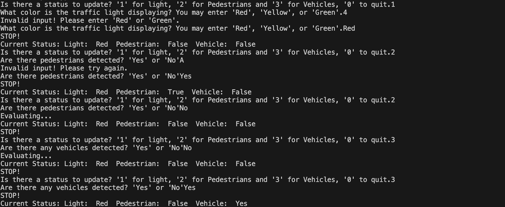

# ENSF692Assignment2MachineVision
# Input_Processing report
Author: Letian Song

## Specification
The Class Sensor has attributes Light, Pedestrian and Vehicle which are initialized to 'Green', False and False respectively. The class contains a constructor for assigning default values, an Update_status function that takes in an object of class Sensor and reassigns values to each attribute based on input arguments. A print_message function that:

Takes in an object of class Sensor and the recorded input from user prompted during execution in 'main'.
This function loops until status has been successfully updated or the user terminates the program using the input'0'.
This function prompts the user for and option out of 3 categories of status updates, Light, Pedestrian and Vehicle.
There are built-in handling procedures for invalid/unexpected input types/values, wherein the program will re-direct the user back to the beginning menu.
Once a status has been updated, the function will print out the current recorded status of the object of class Sensor, as well as give a recommended course of action based on the current status.
Note: the recommendation is given based on the entire range of attributes currently stored inside the object, for instance, if a user updates Vehicle status from True to False,
but legacy input for other attributes prevent affirmative action such as Pedestrian still being stored as "True", the function will "evaluate", then inform the user to "STOP!" even if the last updated status changed to encourage affirmative action. In other words, when and only when all 3 attributes allow the user to proceed or proceed with caution, will the function output the corresponding statement.

## Execution and Testing

